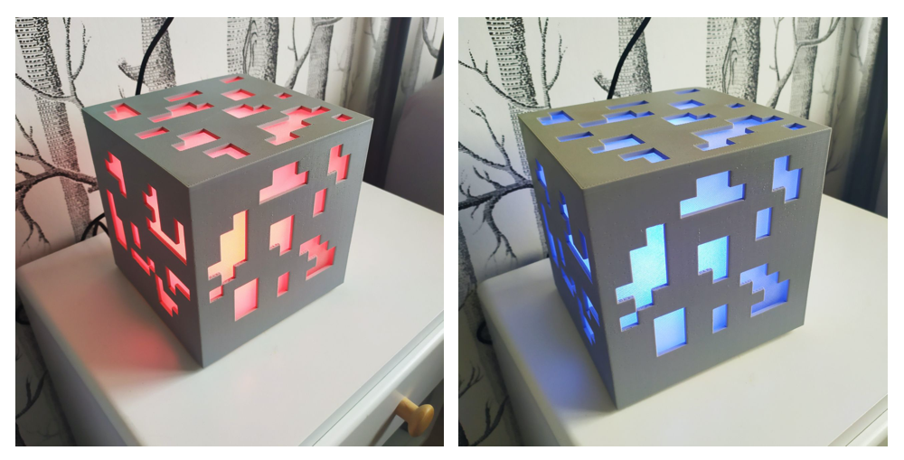
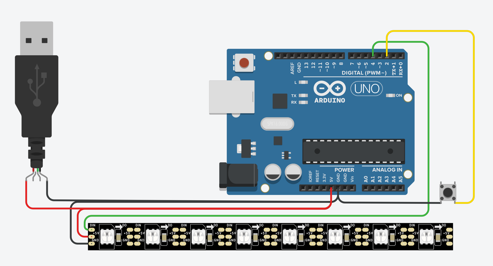
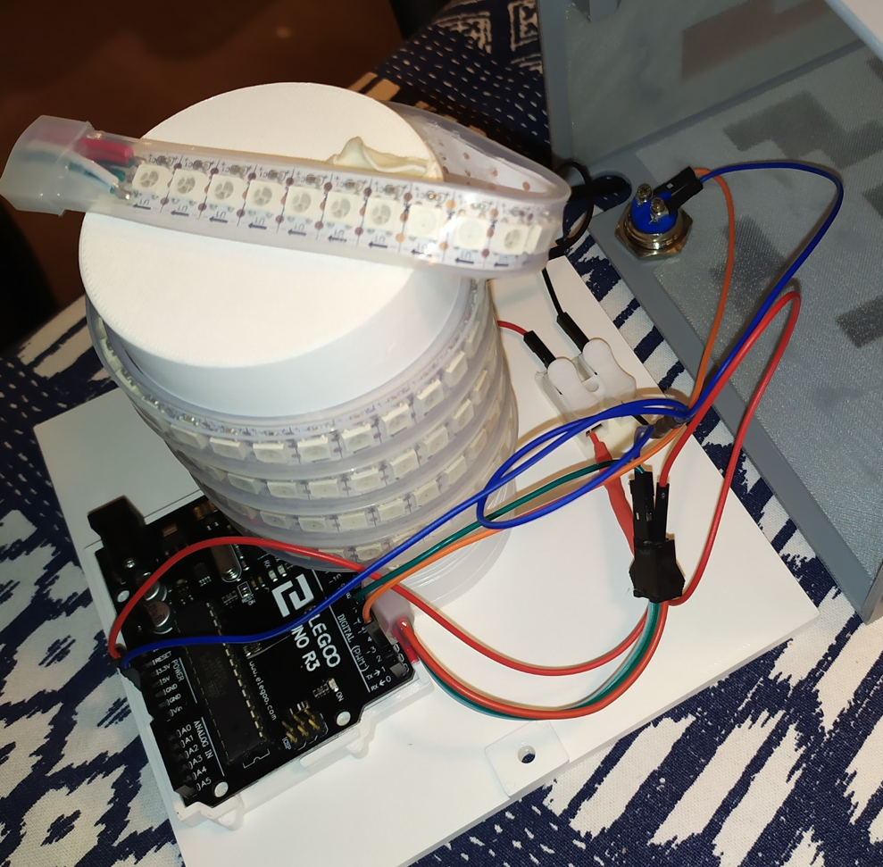
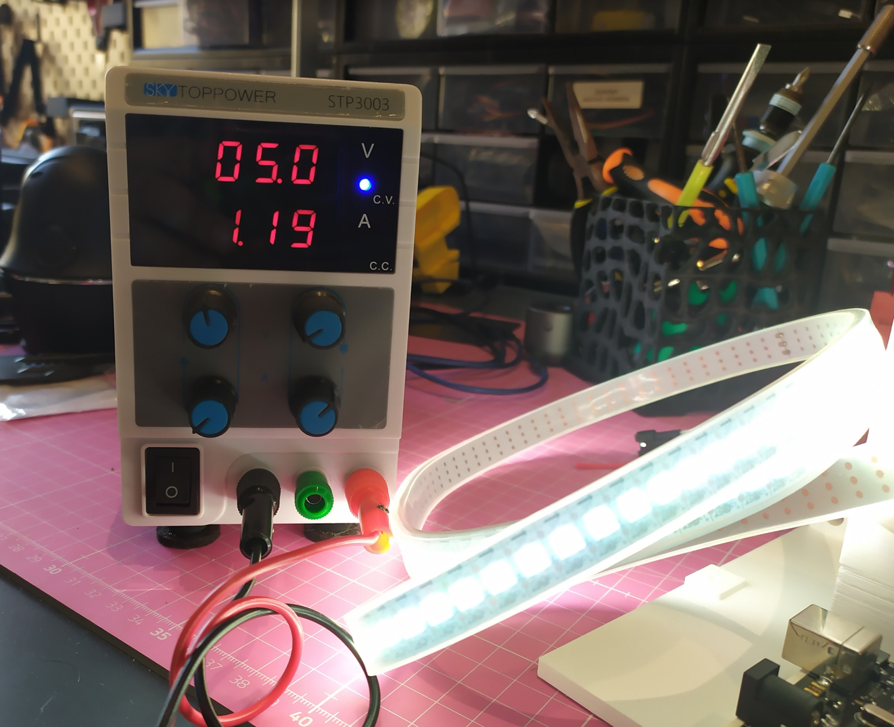
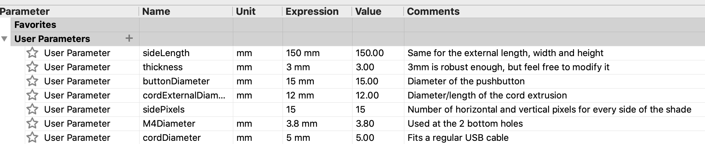
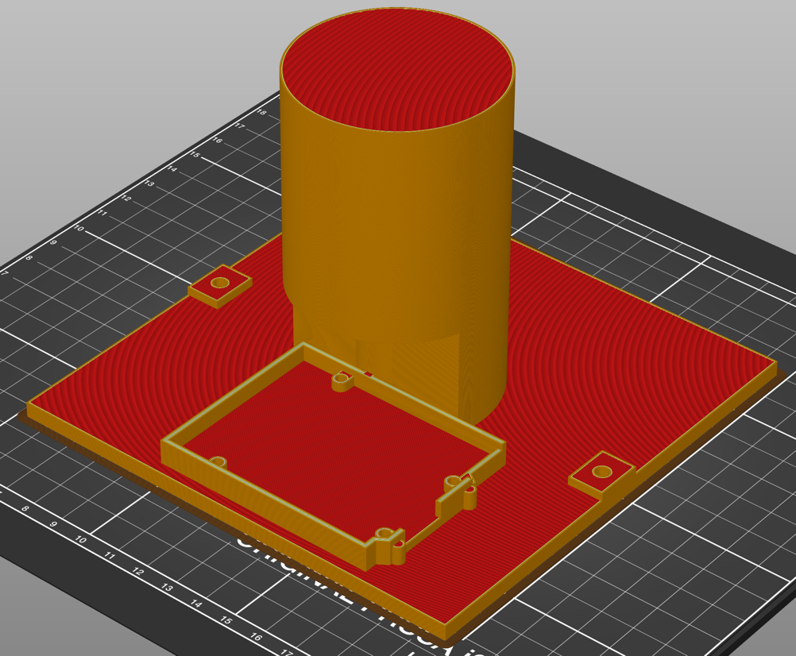

# Customizable Minecraft Ore Lamp <!-- omit in toc -->

- [Bill of materials](#bill-of-materials)
- [Arduino Code](#arduino-code)
- [Electronics](#electronics)
- [3D models](#3d-models)
- [Printing](#printing)

  

My seven-year-old kid is obsessed with Minecraft, so I decided to build something related for him. 

Looking for options, there's a [cool lamp project from Dan J Hamer in Thingiverse](https://www.thingiverse.com/thing:3401758), but after tweaking it a bit I decided to start my own project (you know, the "not invented here" syndrome).

The results are really cool! With one button he can switch to all the available ores (except coal, which I told him is just the lamp switched off).

  

## Bill of materials

* 1 arduino board (I choose the Uno mainly to simplify the design sharing a 5V input with the board and the led strip)
* PLA filament (gray for the main body and translucid for the difussers)
* 1 push-button
* 1 led strip (a 5v and 1m/144leds in my case)
* Typical maker materials (glue, dupont wires, self-solder connectors, M4 screws, etc)

## Arduino Code

There's only a simple [arduino sketch file](src/main.cpp), but the project has been created using the Platformio IDE. If you are not using the Uno board, you'll need to change some parameter values at [platformio.ini](platformio.ini).

## Electronics

Couldn't been easier: power the board and led strip with a 5V USB cable, and connect the push-button and the strip input to the designated board ports.

  

  

The maximum current consumption of the circuit (both for the Uno board and the led strip) is 1.19A, so there shouldn't be a problem connecting it to any standard 5V/2A USB port.

  

## 3D models

You can access the [Fusion 360 project files from here](https://a360.co/2QCthBJ) or [download the STL files from Thingiverse](https://www.thingiverse.com/thing:4584684).

I've used parameters to make easier for others to modify the models according to their needs.

  

For my needs, I made room in the pillar for the Arduino Uno and [merged this base to place the board](https://grabcad.com/library/arduino-uno-rev3-base-original-1) before creating the STL file. 

  

## Printing

Just add supports :)

Also, you'll need to print 5x of the difussers. Two of them have to be cut to make room for the shade lateral supports.